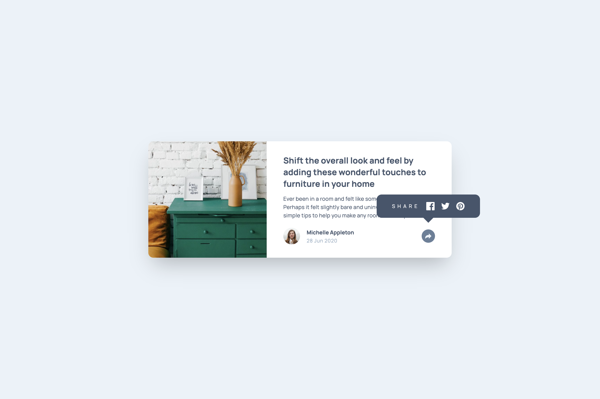

# Frontend Mentor - Article preview component solution

This is a solution to the [Article preview component challenge on Frontend Mentor](https://www.frontendmentor.io/challenges/article-preview-component-dYBN_pYFT). Frontend Mentor challenges help you improve your coding skills by building realistic projects.

## Table of contents

- [Overview](#overview)
  - [The challenge](#the-challenge)
  - [Screenshot](#screenshot)
  - [Links](#links)
- [My process](#my-process)
  - [Built with](#built-with)
  - [What I learned](#what-i-learned)
  - [Continued development](#continued-development)
  - [Useful resources](#useful-resources)
- [Author](#author)

## Overview

### The challenge

Users should be able to:

- View the optimal layout for the component depending on their device's screen size
- See the social media share links when they click the share icon

### Screenshot



### Links

- Solution URL: [GihHub repo](https://github.com/bulhakovolexii/article-preview-component/)
- Live Site URL: [GitHub pages](https://bulhakovolexii.github.io/article-preview-component/)

## My process

### Built with

- Semantic HTML5 markup
- Flexbox
- Mobile-first workflow
- [Tailwind CSS](https://tailwindcss.com/)
- [Typescript](https://www.typescriptlang.org/)

### What I learned

This was my second project using Tailwind and my first using TypeScript. I understand that TypeScript doesn’t offer much advantage for such a simple task, but since I already have solid experience with vanilla JavaScript, I decided to switch to a typed language.

The biggest issue I encountered was the inability to override styles using additional Tailwind classes. To make the tooltip’s visible state classes more specific, I had to switch not the class in TypeScript, but use custom attributes instead:

```html
<div id="share-popup"
     class="data-[open=true]:h-full">
</div>
```

### Continued development

The code ended up cluttered with too many utility classes — perhaps it would be better to extract styles for specific component states into separate definitions.

To run the project locally, you need to have `Node.js` installed, install the dependencies using `npm install`, and start the local development server with `npm run dev`.

### Useful resources

- [Tailwind CSS installation](https://tailwindcss.com/docs/installation/tailwind-cli) - The simplest and fastest way to get up and running with Tailwind CSS from scratch is with the Tailwind CLI tool.

## Author

- GitHub - [@bulhakovolexii](https://github.com/bulhakovolexii)
- Frontend Mentor - [@bulhakovolexii](https://www.frontendmentor.io/profile/bulhakovolexii)
- LinkedIn - [@bulhakovolexii](https://www.linkedin.com/in/bulhakovolexii/)
